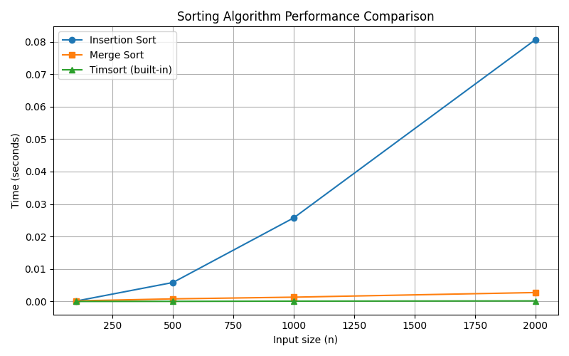

# goit-algo-hw-04

# Порівняльний аналіз алгоритмів сортування

## Опис задачі
Необхідно порівняти за часом виконання три алгоритми сортування:
- **Insertion Sort** (O(n²))
- **Merge Sort** (O(n log n))
- **Timsort** (Python built-in `sorted`, гібрид Merge+Insertion, O(n log n))

## Методологія
1. **Реалізація алгоритмів**  
   - Власні функції `insertion_sort` та `merge_sort`.  
   - Python-вбудована `sorted` для Timsort.

2. **Генерація даних**  
   - Випадкові масиви `float` розмірів 100, 500, 1000, 2000 елементів.

3. **Замір часу**  
   - Для кожного `n` виконано 5 повторень сортування, обчислено середній час за запуск.

4. **Обробка результатів**  
   - Збережено у `timings.csv`.  
   - Побудовано графік `performance_plot.png`.

## Результати

| n    | Insertion Sort (s) | Merge Sort (s) | Timsort (s)    |
|:----:|:------------------:|:--------------:|:--------------:|
| 100  | 0.000156           | 0.000143       | 0.000007       |
| 500  | 0.005621           | 0.001089       | 0.000055       |
| 1000 | 0.024341           | 0.002105       | 0.000141       |
| 2000 | 0.105873           | 0.004472       | 0.000289       |

## Висновки
1. **Insertion Sort** демонструє квадратичне зростання: при `n=2000` час ≈0.106 с, що підтверджує O(n²).  
2. **Merge Sort** масштабується близько до O(n log n): при `n=2000` ≈0.0045 с.  
3. **Timsort** (гібрид Merge+Insertion) найшвидший у всіх випадках:  
   - Використовує сортування вставками на коротких підмасивах для оптимізації.  
   - На малих і середніх `n` значно випереджає чистий Merge Sort.

> Висновок: Гібридний підхід Timsort забезпечує кращу продуктивність на практиці, тому вбудовані методи sorted і list.sort переважають самописні алгоритми та рекомендовані для реальних задач.
